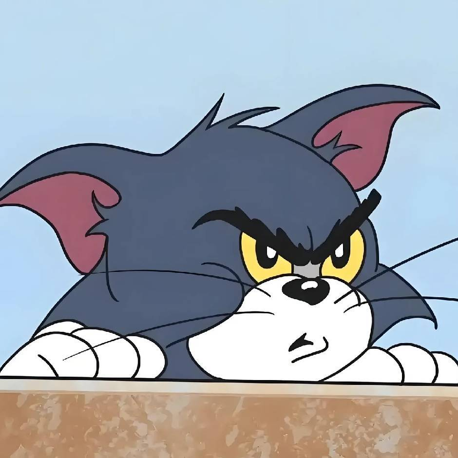
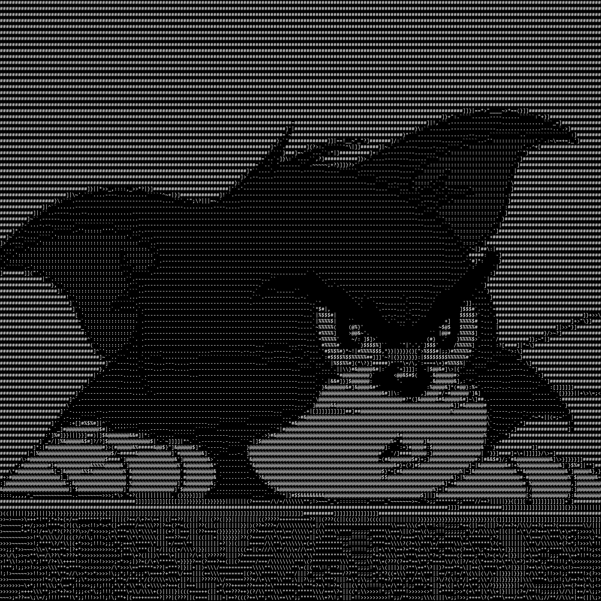
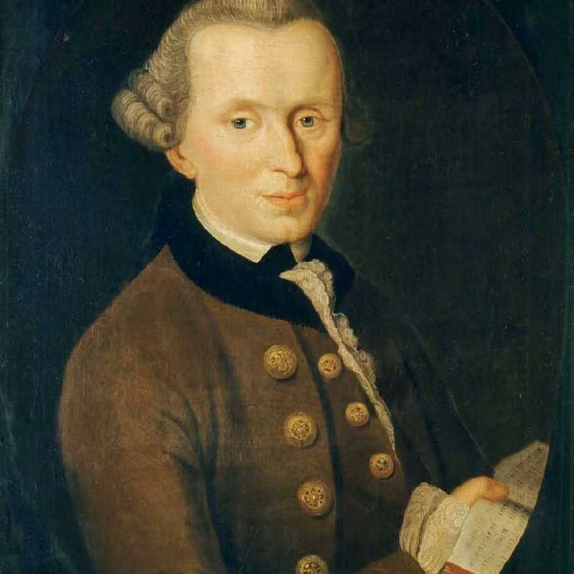
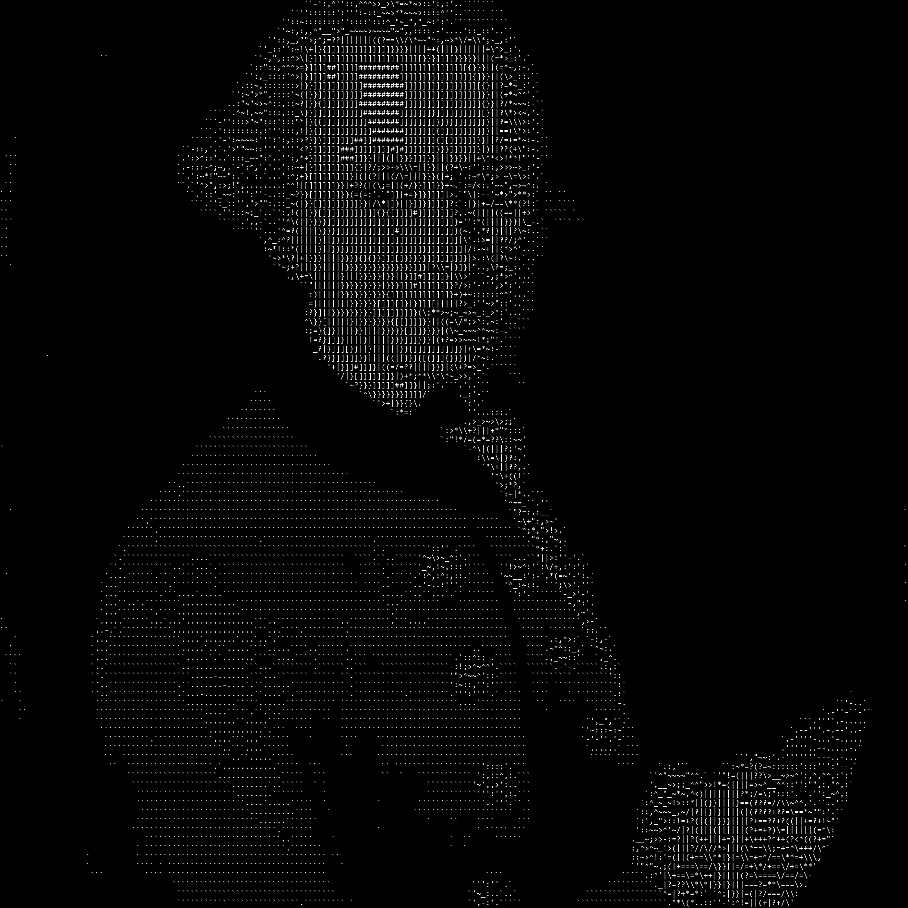

# Asciixel

Asciixel converts images and videos into ASCII art. **Video is supported.**

- **Images:** JPG/PNG input, with terminal, PNG or TXT output.
- **Videos:** MP4 H.264 input, played as ASCII in the terminal. Audio and video export are not supported.

 

 

## Usage

```bash
./build/asciixel examples/cat.jpg                  # Display an image as ASCII
./build/asciixel examples/cat.jpg -o art.png        # Save as PNG
./build/asciixel examples/cat.jpg -o art.txt        # Save as TXT
./build/asciixel examples/video.mp4 --columns 80   # Play the moving ball (30 fps)
bash examples/test.sh                             # Run all examples
```

Videos require an interactive terminal. Conversion progress is shown before
playing; press Ctrl+C to stop. Audio and video export are not supported.
Use fewer columns if the output exceeds your terminal size. Slow terminal
output may delay the video; HDR, rotation and non-square pixels may display
incorrectly.

## Options

| Argument | Default | Description |
| --- | --- | --- |
| `<input-path>` | Required | Path to a single image or supported video |
| `-o, --output <path>` | Terminal output | Save an image to `.png` or `.txt`; the path is required when using this option |
| `--font <path>` | Platform default | Monospace font used for rendering |
| `--font-size <N>` | 24 | Font size in pixels, integer from 1 to 256 |
| `--columns <N>` | 100 | Character columns, integer from 1 to 4096, capped at the source image width; rows follow the image and font cell proportions |
| `-h, --help` | — | Show help; currently requires an input argument |
| `--` | — | End option parsing; subsequent tokens are treated as positional arguments |

Option values accept spaces or equals signs, such as `--columns 80`, `--columns=80`, and `-o=art.txt`.
Output extensions are case-insensitive. Existing output files are never overwritten. For terminal output, use the same font as specified by `--font` for a closer match.

The default font is `C:/Windows/Fonts/consola.ttf` on Windows and
`/usr/share/fonts/truetype/dejavu/DejaVuSansMono.ttf` on Linux.
Use `--font` to choose another installed monospace font.

## Build

### Dependencies

- **Common**: CMake ≥ 3.16, a C/C++ toolchain supporting C++17, and zlib development headers and libraries.
- **Linux**: GCC/G++ and GNU make.
  - Debian/Ubuntu: `sudo apt install build-essential cmake zlib1g-dev`
  - Fedora: `sudo dnf install gcc gcc-c++ make cmake zlib-ng-compat-devel`
- **Windows**: MinGW-w64 (`gcc`, `g++`, and `make` available in PATH) and Git for Windows (provides Bash).
  - The MinGW environment must include zlib headers and libraries; nuwen MinGW 19.0 already bundles them.

### 1. Clone

```bash
git clone --recurse-submodules https://github.com/KAI-SHUNG/Asciixel.git
cd Asciixel
git submodule update --init --recursive
```

### 2. Build FFmpeg

Run the script for your platform:

```bash
./scripts/build-ffmpeg.sh
```

```powershell
./scripts/build-ffmpeg.ps1
```

### 3. Build Asciixel

```bash
cmake -S . -B build -DCMAKE_BUILD_TYPE=Release
cmake --build build --parallel
```

## Testing

Run `ctest --test-dir build --output-on-failure` for automated tests.
On Windows, run the terminal test from an interactive terminal:

```powershell
./build/test_terminal_session.exe ./build/asciixel.exe tests/fixtures/video_bframes.mp4
```
