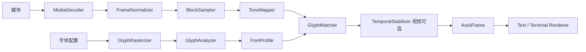

# Asciixel 核心设计

日期：2026-09-22。状态：经设计审查整理的首版规格，尚未实现。

## 1. 目标与决策

首版范围见 [README](../README.md)。采用 C++17、FFmpeg 库和 FreeType。直接使用 FFmpeg 库便于获得显示时间戳、处理解码状态；命令行管道不作为首版后端。

主算法采用图像分块均值与真实字形密度匹配。标定与媒体转换是独立流程，匹配器不依赖 FFmpeg、FreeType 或终端。仅后端需要可替换接口；数值运算使用普通类型与纯函数，避免每个步骤都建立继承体系。

## 2. 数据流与依赖



应用层组织生命周期、配置和错误处理；视频调度器使用时间戳决定何时转换、显示或跳过，不参与匹配计算。静态图片直接从匹配结果构建 AsciiFrame，不经过时间稳定器。

| 组件 | 输入与输出 | 责任和禁止事项 |
| --- | --- | --- |
| MediaDecoder | 文件 → DecodedFrame | FFmpeg 解码、时间戳与色彩元数据；不采样、不选字符 |
| FrameNormalizer | DecodedFrame → LinearImage | 方向、像素宽高比、SDR 色彩、透明度合成；不访问字体 |
| GlyphRasterizer | FontRequest → RasterizedFont | 批量栅格化、计算共同布局、生成统一掩模；不分析源图 |
| GlyphAnalyzer | GlyphMask → GlyphFeatures | 密度计算，未来可扩展空间特征；纯函数 |
| FontProfileBuilder | FontRequest → FontProfile | 调用字体适配器、组织特征分析及进程内缓存 |
| BlockSampler | LinearImage、GridLayout → BlockFeatures[] | 面积加权区域采样；不访问字符集 |
| ToneMapper | 块亮度、MappingConfig、密度范围 → 目标密度[] | 极性与动态范围变换；不选择具体字符 |
| GlyphMatcher | 目标密度、只读 FontProfile → 候选字符[] | 最近密度及确定性平局处理；无历史状态 |
| TemporalStabilizer | 目标密度、候选、上一帧、配置 → 稳定字符[] | 可选有状态迟滞；不读取字体文件 |
| PlaybackScheduler | 帧时间、单调时钟 → 显示决策 | 调度及过期帧策略；不改变帧时间戳 |
| Text/TerminalRenderer | AsciiFrame → 输出 | 文本布局与 ANSI；不重新选择字符 |

## 3. 核心数据契约

以下是接口语义，不是已经实现的头文件：

- `FontRequest`：字体文件、face index、像素字号、灰度栅格化参数、候选字符集；仅包含输入，不包含派生的单元格尺寸/基线。首版 face index 固定为 0，拒绝非等宽字体，不启用合成粗体、斜体和用户可调可变轴。
- `CellGeometry`：实际单元格宽高、共同原点与基线，由字体适配器计算。
- `RasterizedFont`：字体内容标识、实际渲染参数、CellGeometry 和全部候选的拥有型 GlyphMask。
- `ResolvedTheme`：应用层由主题解析出的固定线性 RGB 前景/背景，供归一化、映射和输出共享。
- `TerminalSize`：可见终端字符列数与行数，由终端适配器查询，不包含像素尺寸。
- `GlyphMask`：字符、固定单元格宽高、拥有型 alpha 数组，范围 [0,1]；坐标从左上角开始。
- `GlyphFeatures`：字符、覆盖率；可选空间特征仅属于后续扩展。
- `FontProfile`：不可变配置标识、实际 cellWidth/cellHeight、共同原点及 baseline、字符特征、按密度及码点排序的索引、dmin/dmax。字形位图可作为独立 atlas 保留，避免匹配器依赖渲染资源。
- `DecodedFrame`：拥有或共享拥有的像素缓冲、宽高、每平面 stride、像素格式、方向/SAR/颜色元数据，以及可缺省的显示时间与时长；不得暴露 AVFrame*。
- `LinearImage`：顶左坐标、正向连续 float RGB、线性 sRGB、alpha 已合成；携带纠正后的显示宽高比及时间信息。
- `GridLayout`：列数、行数、采样边界；字符单元尺寸来自 profile。
- `BlockFeatures`：每块线性平均亮度；采样输出按行排列。
- `AsciiFrame`：列数、行数、按行字符数组、profile 标识、固定前背景颜色、微秒时间戳及可缺省时长。

所有跨模块缓冲明确拥有所有权或使用受控共享所有权；临时 view 只在同步调用期间有效。转换/匹配核心不含 FFmpeg、FreeType 头文件。FFmpeg 的像素格式映射为项目定义的枚举；首版仅定义归一化器实际支持的格式，适配器负责转换或明确拒绝。

FFmpeg 和 FreeType 资源由适配器内的 RAII 管理；错误向应用层返回带组件、操作及原因的错误对象。参数语法、范围和已知互斥关系在读取媒体前验证；媒体类型、显示比例和解码支持在打开媒体后验证，所有验证通过后才创建输出文件。

### 3.1 CLI 与应用配置

首版命令形式为 `asciixel <input> --font <path> [options]`，仅接收本地文件。参数名大小写敏感；路径含空格时按 shell 规则加引号；支持 `--name value` 和 `--name=value`。未知参数、重复参数、多余位置参数均报错。

| 参数 | 默认值 | 规则 |
| --- | --- | --- |
| `<input>` | 必填 | 单个可读本地文件；不支持 stdin、URL、目录或序列通配符 |
| `--font <path>` | 必填 | 可读等宽字体文件，使用 face 0 |
| `--font-size <N>` | 16 | 十进制整数，1～256，单位为像素 |
| `--format terminal\|txt` | terminal | terminal 要求 stdout 为可查询尺寸且支持 ANSI 的交互终端；不自动根据重定向改变格式 |
| `--output <path\|->` | txt 时为 `-` | 仅 txt 可用；`-` 写 stdout，路径写文件；terminal 指定此参数报错 |
| `--columns <N\|auto>` | terminal 为 auto，txt 为 120 | N 为十进制整数 1～4096；txt 不接受 auto |
| `--theme dark\|light` | dark | 分别为黑底白字与白底黑字 |
| `--mapping stretch\|faithful` | stretch | 分别对应密度铺满与亮度保真，与 theme 正交 |
| `--hysteresis <h>` | 视频为 0.005 | 有限十进制实数，0～1，覆盖率单位；0 关闭；静态图片显式设置时报错 |
| `--help` | 关闭 | 单独使用时输出帮助到 stdout 并退出 0，无需 input/font |

TXT 仅接受静态 PNG/JPEG；视频指定 txt 报错，不自动抽首帧。静态 PNG/JPEG 按图片处理，其余首版支持的视频容器按视频处理；不以帧率或估计帧数猜测类型，动画图片不在首版支持范围。TXT 的 columns 默认值与运行终端无关。首版不提供覆盖开关：输出文件已存在时报错，创建时使用排他语义；输出路径不得指向输入或字体文件。日志、警告和错误均写 stderr，stdout 不混入诊断信息。

退出码：0 成功，2 参数错误/配置冲突，1 文件、字体、解码、终端或写出运行错误，130 用户中断。参数错误信息至少包含参数名、收到的值及允许范围，例如 `invalid --columns: 0; expected integer 1..4096 or auto`；不固定其他措辞。输入类型不适配所选格式按配置冲突退出 2。文件写入中断时允许留下部分文件，错误说明输出路径，不声称导出成功。

应用层先解析 CLI 为请求配置，再解析主题、字体 profile 和网格等派生配置，传给各组件；组件不重复解析 CLI 字符串。除终端适配器外，任何组件不得调用终端尺寸 API。

### 3.2 主题与透明背景

dark 解析为前景 (1,1,1)、背景 (0,0,0)；light 解析为前景 (0,0,0)、背景 (1,1,1)，均为线性 RGB。首版不提供独立透明合成背景参数。FrameNormalizer 使用同一 ResolvedTheme.background 在线性空间合成直通 alpha：`rgb = alpha * rgb + (1-alpha) * background`；若解码结果为预乘 alpha，适配器先按其表示正确归一化。

ToneMapper 使用同一主题的 F/B，TerminalRenderer 显式设置对应前背景色而非依赖终端默认主题；退出时恢复状态。TXT 不保存颜色元数据，用户需用相应背景查看。完全透明区域在两种主题及两种映射下均应选择空格。

## 4. 字体标定

### 4.1 字符与单元格

枚举 32～126 共 95 个可打印 ASCII，包括空格。用 FT_Get_Char_Index 检查缺字；缺字时报错并列出字符，不把 .notdef 当作候选。

通过 FT_New_Face、FT_Set_Pixel_Sizes、FT_Load_Char/FT_Render_Glyph 获取灰度覆盖位图。正确解释 pixel_mode、num_grays 和有符号 pitch，统一为 [0,1] alpha；不使用 LCD 子像素模式。每次加载新字形前复制所需数据，避免复用 slot 导致旧数据失效。

布局对所有字符使用相同 pen origin 和 baseline；利用 bitmap_left、bitmap_top 定位，不逐字居中。单元格宽度至少容纳统一 advance 和全部候选字形的水平边界；高度至少容纳选定行高及全部字形上下边界。必要时整体增加边距并统一平移原点，不单独裁切字形。实际单元格尺寸进入 profile，并用于网格比例和未来图像渲染。

上述流程全部归 GlyphRasterizer：先将全部字符各栅格化一次，复制保存原始字形位图及 bearing/advance；再求字形边界并集和共同 CellGeometry；最后分配统一大小的掩模并复制已有位图，返回 RasterizedFont。不重建请求配置，不进行第二次字形栅格化。FontProfileBuilder 对返回掩模调用 GlyphAnalyzer；缓存查找以字体内容、请求和后端参数为键，结果保存完整派生布局，避免以尚未计算的尺寸作为首次查找前提。

严格检查全部候选（包括空格）的水平 advance 一致性；字体声明等宽但实际候选不满足时拒绝。首版默认布局由上述规则自动生成，用户只需指定字体和字号。

### 4.2 覆盖率

对完整单元格的字形 alpha 掩模 A_c：

```text
mass(c)    = sum(A_c[x,y])
density(c) = mass(c) / (cellWidth * cellHeight)
```

不能数非零像素，不能用紧包围盒面积归一化。空格为零。将候选按 `(density, ASCII码点)` 排序；相同密度以较小码点稳定取胜。若 dmax <= dmin，标定失败。

标定只在配置变化时进行。进程内缓存键包括字体内容哈希、face index、字号、实际布局、实际字重/轴状态、栅格化参数及后端版本、字符集。首版不实现磁盘缓存。

### 4.3 输出一致性

覆盖率是几何 alpha，不等于未经校正的屏幕像素亮度。后述保真公式要求线性 alpha 合成；未来自有图像渲染器必须使用同一 atlas、布局和合成规则，最后编码到 sRGB。

终端不能保证相同字体、行距、hinting 或合成规则，也无法通过通用 ANSI 查询这些信息。终端是近似预览：用户自行设置字体；程序不声称测得实际终端亮度。任何自动扩大的标定单元格都会进一步影响与终端实际排版的吻合程度。

## 5. 图像采样与字符选择

### 5.1 归一化和网格

首版输入为 SDR。归一化器按元数据处理 YUV 矩阵、范围及传递函数，转到线性 sRGB；FFmpeg 色彩/缩放转换不自动等价于完成线性化。PNG/JPEG 未标记时默认 sRGB；视频缺失颜色元数据时采用固定回退规则（高清 BT.709、标清 BT.601，未指定 YUV 范围按 limited），发出一次提示，记录实际选择。无法支持的色彩描述或 HDR 明确拒绝，不静默套用 SDR。首版不承诺 ICC 色彩管理。

方向变换后，设显示宽高比为 a（包含 SAR），字符单元为 cw×ch，指定列数 C：

```text
R = max(1, round(C / a * cw / ch))
```

例如 a=16/9、cw/ch=1/2、C=160，得到 R=45。正数 round 使用半值向上取整。首版支持显式列数和自动列数，触发及默认值见 CLI 表。TXT 不受终端尺寸约束，但所有输出都限制网格最多 1,048,576 个字符，乘法检查溢出，超限报错。

终端适配器查询 stdout 对应的可见字符区域，返回 TerminalSize{columns, rows}；Windows 后端使用控制台可见窗口边界计算行列数，不使用滚动缓冲区总高度。无法取得有效尺寸时 terminal 模式报错，不猜测 80×24。查询实现留在平台适配器内。

统一预留最后一列和最后一行，故可用区域为 W=columns-1、H=rows-1；两者必须大于零。显式模式直接检查 C<=W 且 R<=H，失败时报告所需 C×R 和可用 W×H。无需将字体像素换算成终端像素：cw/ch 只参与视觉比例，容量比较全部使用字符格。自动模式在 1..min(W,4096) 中选择满足 R(C)<=H 且不超过字符总数上限的最大 C，无可行值时报错。

首版播放期间固定布局，每次显示前重新查询尺寸；缩小后仍能容纳则继续，否则恢复终端并退出 1，提示调整窗口或 columns。不自动改变字符网格或重建历史；窗口增大也不重新布局。

将纠正后的图像均匀分成 C×R 个连续区域，按每个源像素与区域重叠面积求平均。不要直接双线性采一个中心点代替区域均值。线性 RGB 的亮度：

```text
Y = 0.2126 * R + 0.7152 * G + 0.0722 * B
```

透明像素先在线性空间与 ResolvedTheme.background 合成，来源及极性见 3.2。输出每块亮度 L∈[0,1]；不做逐帧自动直方图拉伸，避免视频亮度抽动。

### 5.2 默认：铺满密度范围

首版 T(L)=L，不暴露额外曲线参数。黑底白字取 q=T(L)，白底黑字取 q=1-T(L)：

```text
target = dmin + q * (dmax - dmin)
glyph  = argmin_c (target - density(c))²
```

这保留输入层次但压缩绝对亮度范围。普通 ASCII 中最密字符也通常不等于满覆盖，不应把它当作纯白方块。

### 5.3 可选：亮度保真

固定前景亮度 F、背景亮度 B：

```text
predicted(c) = B + (F-B) * density(c)
glyph = argmin_c (L - predicted(c))²
```

首版 F/B 仅为 1/0 或 0/1。ToneMapper 可将其转为 `(L-B)/(F-B)` 并夹到 [dmin,dmax]，复用相同匹配器；超出可呈现范围自然饱和。此模式描述数学目标，不承诺终端物理亮度保真。

### 5.4 匹配及迟滞

最近密度匹配使用排序表二分，相邻密度中点是判定边界。等距时选较小 ASCII 码点。95 个字符无需 GPU；查找表属于可选优化。

视频迟滞以目标密度和前一已显示字符的密度为输入：旧字符的最近邻密度区间向两端各扩展 h；目标仍在扩展区间则保留，否则采用当前最佳字符。h 为覆盖率单位，默认 0.005，允许设置为 0。相同密度仅使用确定性代表字符。静态图片不启用迟滞。

首次显示、seek、时间戳倒退、profile/网格变化、相邻已显示帧间隔大于 250ms 时清空历史。被调度器跳过的帧不更新显示历史。显著超出扩展区间的变化立即切换，不做累积低通滤波。

## 6. 解码、调度与输出

av_read_frame 后只向目标视频流解码器发送 packet。处理 send/receive 的 EAGAIN：未成功发送的 packet 保留并重试；循环 receive 到需要更多输入。EOF 发送空 packet 并接收至 EOF，不能假设一个 packet 产生一帧。

解码输出的显示时间优先使用有效 best_effort_timestamp，按流 time_base 转为微秒，不使用 packet DTS 播放。首帧显示时间为零；首帧有原始时间戳时建立偏移。首帧缺失时间戳时先合成时间，首次遇到有效时间戳时将其对齐到合成序列的下一时刻并固定偏移，不能突然回到零。后续缺失时间戳时，使用上一显示时间加上一帧有效时长，次选流帧率，均不可得则按 30fps 回退并提示。异常非递增时间采用同样的合成步长推进并提示，重置迟滞。图片无须播放时间轴。

steady_clock 的目标时刻为播放起点加归一化显示时间。首版单线程串行、内存有界，不读取整个视频；允许一帧前瞻，用下一帧时间确定当前显示区间。只有整个显示区间已经结束才判定过期，可跳过转换/显示继续解码追赶；轻微晚于开始时刻仍显示，避免所有帧都被跳过。最后一帧仍需显示，有有效时长时保持该时长，否则按上述步长估计。保留响应中断的机会，不使用一次性长 sleep。

TerminalRenderer 在视频播放时进入替代屏幕、隐藏光标，帧缓冲一次写出；光标归位更新而非执行外部清屏命令。静态图片在普通屏幕一次绘制并保留结果，随后恢复颜色，不进入退出即消失的替代屏幕。通过 RAII 在正常结束、可处理错误及用户中断时恢复状态；Windows 适配层开启并恢复 VT 模式。非交互 stdout 使用 terminal 格式时始终报错，静态图片可显式选择 txt。

TextRenderer 输出 UTF-8、无 BOM、无 ANSI；每行恰好 C 个 ASCII 字符，保留所有行尾空格，每行后写一个 LF（包括最后一行），共 R 行。Windows 文件及重定向 stdout 使用二进制输出，避免 LF 隐式变为 CRLF；如修改输出模式，结束时恢复。该规则不约束交互终端的光标控制实现。

## 7. 验证策略与后续扩展

单元验证覆盖率归一化、alpha 边缘、空格、缺字、负 pitch、字形越界；用人工构造小掩模验证公式，而非只重复实现逻辑。采样使用常量、棋盘格和非整数边界的手算结果。映射检查极性、饱和、等距与重复密度。调度使用可注入时钟验证变帧率、缺失时间戳和迟滞重置；集成用短视频验证 EOF 排空和退出恢复。构建及字体测试素材需在实现时固定版本并确认可再分发。

配置验收覆盖缺少必填项、非法枚举/数值、NaN/无穷、重复参数、txt+auto、terminal+output、视频+txt、图片显式迟滞和现存输出文件。终端布局以可注入尺寸验证预留行列、刚好容纳、无可行网格及缩小退出。字体布局验证先保存再统一排布、不二次栅格化。透明合成覆盖两种主题与两种映射组合；TXT 按字节验证无 BOM、无 CR、末尾 LF、尾随空格及 stdout 无日志污染。

后续形状匹配可添加 4×4 局部覆盖率特征；它与均值匹配共享采样/字体分析流程，但需单独定义对比度归一化和权重，通过图像样例验证，首版不冻结未经验证的空间损失公式。彩色输出需共同处理字形密度与前景颜色，不能宣称块平均 RGB 自动保持亮度。PNG/MP4 导出通过独立 atlas renderer 和 encoder 接入，离线输出不沿用实时丢帧策略。

## 8. 接口参考

- [FreeType 字形加载、渲染及 slot 生命周期](https://freetype.org/freetype2/docs/reference/ft2-glyph_retrieval.html)
- [FreeType 位图与 pixel mode](https://freetype.org/freetype2/docs/reference/ft2-basic_types.html)
- [FFmpeg 解码接口](https://www.ffmpeg.org/doxygen/trunk/group__lavc__decoding.html)
- [FFmpeg libswscale](https://ffmpeg.org/doxygen/trunk/group__libsws.html)
- [Windows DirectWrite 字形分析（可选后端，首版不用）](https://learn.microsoft.com/en-us/windows/win32/api/dwrite/nn-dwrite-idwriteglyphrunanalysis)
